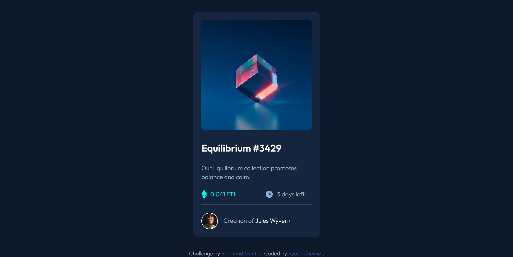

# Frontend Mentor - NFT preview card component solution

This is a solution to the [NFT preview card component challenge on Frontend Mentor](https://www.frontendmentor.io/challenges/nft-preview-card-component-SbdUL_w0U). Frontend Mentor challenges help you improve your coding skills by building realistic projects. 

## Table of contents

- [Overview](#overview)
  - [Screenshot](#screenshot)
  - [Links](#links)
- [My process](#my-process)
  - [Built with](#built-with)
  - [What I learned](#what-i-learned)

## Overview

### Screenshot

### Links

- Solution URL: [Solution](https://github.com/codeinnit92/stat-preview-card-challenge)
- Live Site URL: [Live Site](https://codeinnit92.github.io/stat-preview-card-challenge/)

## My process

### Built with

- Semantic HTML5 markup
- CSS custom properties
- Flex
- Desktop-first approach

### What I learned 

I learned how to work with links on this particular challenge and by using pseudo-classes and pseudo-elements I learned how to do some pretty decent looking things like the hover effect on the image.

